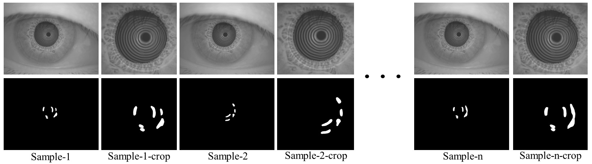
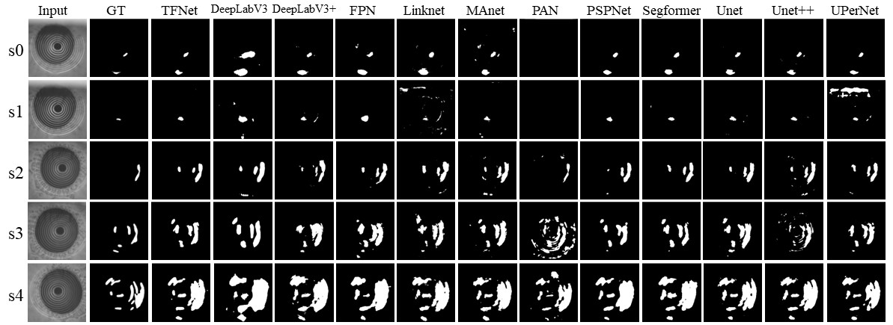

# TFM Dataset & Benchmark: Automated Tear Film Break-Up Analysis 

**📄 Paper:** *"TFM Dataset: A Novel Multi-task Dataset and Integrated Pipeline for Automated Tear Film Break-Up Segmentation"* 

**🏠 Project Page:** *[coming soon]*

This repository is the official implementation of our IEEE TMI paper. We introduce the **Tear Film Multi-task (TFM) Dataset**, the first comprehensive public benchmark for multi-task tear film analysis, alongside **TF-Net**, an efficient segmentation model, and **TF-Collab**, an integrated pipeline for fully automated tear film break-up (TFBU) analysis.

## 🚀 News

- **[2025-10-08]**  🎉 The code of TF-Net and training scripts are released!
- **[2025-10-07]**  🎉 TFM Dataset of TF-Net is released !

## ✨ Highlights

- **🧬 TFM Dataset:** The first public dataset with **6,247 high-resolution images** annotated for three vision tasks: **frame classification**, **Placido ring detection**, and **pixel-wise TFBU segmentation**.
- **⚡ TF-Net:** A novel, computationally efficient segmentation model using a re-parameterized MobileOne-mini backbone and Pyramid Pooling Module, achieving real-time performance.
- **🔄 TF-Collab Pipeline:** An integrated, end-to-end pipeline that synergistically combines classification, detection, and segmentation models to fully automate TFBU analysis, mirroring the clinical workflow.
- **🏆 Benchmark:** We provide benchmark results against numerous state-of-the-art medical image segmentation models.

## 📊 TFM Dataset Overview

The TFM Dataset is designed to foster research in automated dry eye diagnosis.

### 📊 Dataset Statistics

The TFM Dataset comprises 6,247 high-resolution frames extracted from 15 clinical videos, annotated for three complementary vision tasks.

### Task-wise Distribution

| Task | Categories | # Annotations | Resolution | Split (Train:Val:Test) |
| :--- | :--- | :--- | :--- | :--- |
| **Classification (TF-Cls)**   | 'Clear', 'Closed', 'Broken', 'Blur' | 6,247 | 3632 × 2760 | 4,687:561:999(75%:9%:16%) |
| **Object Detection (TF-Det)** | Inside, Middle, Outside Rings | 4,736 | 3632 × 2760 | 3,546:430:760(75%:9%:16%) |
| **Segmentation (TF-Seg)** | TFBU Area | 873 | 1498 × 1337(TF-Crop) | 678:69:126(78%:8%:14%) |


### Annotation Examples

Overview of the **Tear Film Multi-task (TFM)** Dataset composition, illustrating the distribution and relationships between the three annotation tasks: classification (TF-Cls), object detection (TF-Det), and segmentation (TF-Seg).


Sample visualization of the **TF-Crop** dataset from cropping strategy.. The first row displays the original full-resolution images (left) and their corresponding cropped versions (right), which are generated based on the "Outside" bounding boxes from the TF-Det dataset. The second row presents the visualizations of the pixel-wise TFBU segmentation masks for the respective images above.



### Download

The TFM Dataset can be downloaded from the following sources:

[Baidu Netdisk, key:TFMD](https://pan.baidu.com/s/1yRtk-LomR3y7qZlHUTtNjw?pwd=TFMD) 

[Google Drive](https://drive.google.com/drive/folders/1OSCDdOlNS-yKKZxybzqgjKrVLGC-XtHU?usp=drive_link)

The structure of the dataset in the cloud disk is as follows

```
TFMDataset/
    ├── TFM-dataset/
    │    ├── images.zip
    │    └── labels.zip 
    ├── TFM-crop/
    │    ├── crop_broken_only.zip
    │    ├── crop_full.zip
    │    └── crop_non_broken.zip
    └── video.zip # 15 original tear film videos based on placido rings
```

**📝 License for Data:** The TFM Dataset is available for **non-commercial research purposes only**. Please see the  [`DATASET LICENSE.md`](https://github.com/glory-wan/TF-Net/blob/main/DATASET_LICENSE.md) for details. By downloading, you agree to the terms.

## 🛠️ Installation & Quick Start

### 1. Environment Setup

```
git clone https://github.com/glory-wan/TF-Net.git
cd TF-Net

conda create -n TFNet python=3.11 -y
conda activate TFNet

pip install -r requirements.txt
```

```
pytorch==2.5.1 torchvision==0.20.1 torchaudio==2.5.1
```

### 2. Data Preparation

1. Download the TFM Dataset from the link above.
2. Extract it into the `dataset/` directory. The structure should look like:

```
TFM dataset/
    ├── images/
    │    ├── train
    │    │    ├── train1.png
    │    │    ├── train2.png
    │    │    └── ...
    │    ├── val
    │    │    ├── val1.png
    │    │    ├── val2.png
    │    │    └── ...
    │    └─── test
    │         ├── test1.png
    │         ├── test2.png
    │         └── ...
    ├── labels/
    │    ├── classification
    │    │    ├── train_cls.txt
    │    │    ├── val_cls.txt
    │    │    └── test_cls.txt
    │    ├── detection
    │    │    ├── train
    │    │    │     ├── train1.txt
    │    │    │     └── ...
    │    │    │
    │    │    ├── val
    │    │    │     ├── val1.txt
    │    │    │     └── ...
    │    │    └─── test
    │    │          ├── test1.txt
    │    │    	    └── ...
    │    └─── segmentaiton (The structure is the same as detection)
    │         └── ...
    └── TF-Crop/ # The pre-cropped ROI subset for segmentation
```

crop_broken_only(i.e. TF-Crop, used for segmentation model training)

crop-full, and crop-non-broken are used for ablation experiments.

The structure of TF-Crop should look like:

```
 crop_broken_only/
      (crop_full)/
(crop_non_broken)/
        ├── images/
        │    ├── train
        │    │    ├── train1.png
        │    │    ├── train2.png
        │    │    └── ...
        │    ├── val
        │    │    ├── val1.png
        │    │    ├── val2.png
        │    │    └── ...
        │    └─── test
        │         ├── test1.png
        │         ├── test2.png
        │         └── ...
        └── masks/ (The structure is the same as that of images)
            ├── ...
            ...
```

## 🧠 Model Zoo & Benchmark

### TF-Net & trained Models

We provide trained `weight` for TF-Net. The other baseline models are trained by [segmentation_models](https://github.com/qubvel/segmentation_models) library .

Download link for the weights of the trained TF-Net: [Baidu Netdisk ( key:TFMD)](https://pan.baidu.com/s/1yRtk-LomR3y7qZlHUTtNjw?pwd=TFMD) or [Google Drive](https://drive.google.com/drive/folders/1OSCDdOlNS-yKKZxybzqgjKrVLGC-XtHU?usp=drive_link)

### Training & Evaluation

1. **Train TF-Net from scratch:**

   ```
   python train_command.py --data_dir path/to/TF-crop
   ```

2. **Predict on the test set:**

   ```
   python predict_mask.py --model_path path/to/model/like/TFNet_2_0.25_mobileone-mini.pt --image_dir path/to/folder/saved/images --output_path path/to/save/folder
   ```

3. **calculate metrics**: Iou, DSC, Recall, FPR, HD95, ASSD

   ```
   python get_metrics_to_csv.py --gt_folder path/to/gt/folder --pred_folder path/to/predicted/masks/folder  --save_folder path/to/save/folder
   ```

#### Additional Utility Scripts

1. **Calculate model parameters and FLOPs:**

   ```
   python get_params_flops.py
   ```

2. **Measure model inference time:**

## 📈 Results

### Quantitative Segmentation Results on TF-Crop Test Set

Our TF-Net achieves a favorable balance between accuracy and speed, making it ideal for real-time clinical applications.



| Model     | Param(M) <br />train/infer | Flops(G)<br /> train/infer | FPS(ms) <br />GPU/CPU | mIoU  | mDSC  | mRecall | HD95↓ | ASSD↓ |
| --------- | -------------------------- | -------------------------- | --------------------- | ----- | ----- | ------- | ----- | ----- |
| TF-Net s0 | 0.72/0.65                  | 2.7/2.4                    | 92.2/20.0             | 0.698 | 0.779 | 0.975   | 212.9 | 54.1  |
| TF-Net s1 | 2.6/2.3                    | 8.9/7.9                    | 51.5/10.3             | 0.711 | 0.792 | 0.976   | 182.0 | 47.8  |
| TF-Net s2 | 5.7/5.2                    | 19.8/17.6                  | 24.5/6.1              | 0.720 | 0.800 | 0.973   | 180.8 | 47.0  |
| TF-Net s3 | 10.2/9.2                   | 35.1/31.3                  | 17.8/4.2              | 0.721 | 0.801 | 0.972   | 187.5 | 51.9  |
| TF-Net s4 | 15.9/14.4                  | 54.6/48.8                  | 10.3/3.0              | 0.737 | 0.814 | 0.965   | 175.6 | 44.8  |
| TFNet s5 | 22.91/78.52 | 20.69/70.23 | 0.722 | 0.801 | 0.969 | 186.8 | 48.1 |
| TFNet s6 | 40.71/139.24 | 36.77/124.75 | 0.738 | 0.815 | 0.965 | 217.8 | 59.0 |

## 📄 License

This project's code is released under the [LICENSE](https://github.com/glory-wan/TF-Net/blob/main/LICENSE). The TFM Dataset is for **non-commercial research use only**. Please refer to  for the [DATASET_LICENSE](https://github.com/glory-wan/TF-Net/blob/main/DATASET_LICENSE.md) terms.

## 📜 Citation

If you use the TFM Dataset, TF-Net, or TF-Collab in your research, please cite our paper:

```

```
